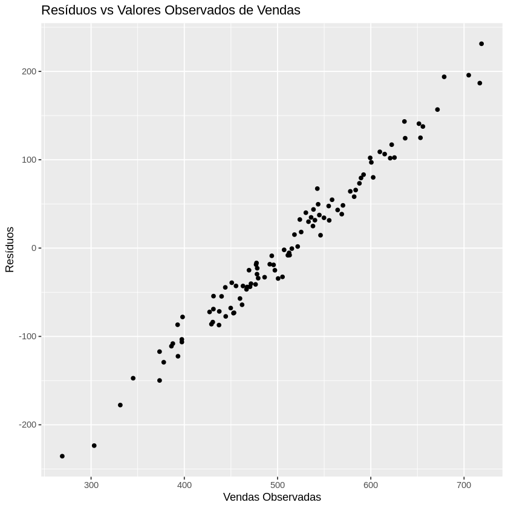

# Projeto de Regressão Linear Múltipla em R

## Descrição

Este é o meu primeiro projeto em R, criado para explorar a regressão linear múltipla e entender a relação entre vendas e fatores de publicidade. O objetivo do projeto foi analisar como variáveis independentes, como gastos com publicidade em TV, rádio e jornal, influenciam as vendas de uma empresa. Este projeto marcou o início da minha jornada com R e é uma introdução às técnicas de modelagem estatística.

## Conteúdo

- **`vendas_data.csv`**: Conjunto de dados fictício com informações sobre vendas e gastos com publicidade.
- **`modelo_regressao.R`**: Script R que inclui:
  - Criação e análise do modelo de regressão linear múltipla.
  - Resumos e diagnóstico do modelo.
  - Geração de previsões com novos dados.
  - Salvamento do modelo para uso futuro.

## Funcionalidades

- **Análise Estatística**: Utiliza regressão linear múltipla para modelar a relação entre vendas e fatores de publicidade.
- **Diagnóstico do Modelo**: Inclui gráficos de diagnóstico para verificar as suposições do modelo.
- **Previsões**: Faz previsões com base em novos dados de gastos com publicidade.
- **Persistência do Modelo**: Salva o modelo para futuras análises.

## Como Executar

1. **Instale as dependências**: Certifique-se de que você tem o R instalado e as bibliotecas necessárias. Execute o comando:
   ```r
   install.packages("tidyverse")
   ````

2. Carregue o Script: Execute o script modelo_regressao.R no R para carregar os dados, criar o modelo, analisar os resultados e gerar previsões.

3. Explore os Resultados: Verifique o resumo do modelo, gráficos de diagnóstico e previsões geradas para entender a relação entre as variáveis.

## Resultados
 
 
 
 
 

## Explicação dos Gráficos: 

### Residuais vs Fitted :

O gráfico mostra a relação entre os valores ajustados (Fitted values) e os resíduos (Residuals) do modelo.
Observa-se uma distribuição relativamente uniforme dos resíduos em torno do zero, sugerindo um bom ajuste do modelo.
Há alguns outliers com valores mais extremos de resíduos, indicando possíveis observações que não se ajustam bem ao modelo.


### Q-Q Residuals :

O gráfico de probabilidade normal dos resíduos (Q-Q plot) mostra que a distribuição dos resíduos se aproxima bastante da normalidade.
Alguns pontos nas extremidades se afastam ligeiramente da linha reta, indicando possíveis desvios da normalidade.


### Scale-Location:

Este gráfico apresenta a distribuição dos resíduos padronizados em função dos valores ajustados.
A distribuição parece relativamente uniforme, com alguns pontos mais dispersos, sugerindo homocedasticidade (variância constante) dos resíduos.


### Residuals vs Leverage :

O gráfico mostra a relação entre os resíduos padronizados e a influência (leverage) de cada observação no modelo.
Observa-se que a maioria das observações possui baixa influência, com alguns pontos mais influentes.
Esses pontos influentes podem representar observações que afetam significativamente o ajuste do modelo.


### Resíduos vs Valores Observados de Vendas:

Este gráfico relaciona os resíduos com os valores observados de vendas.
Não é possível identificar nenhum padrão claro na distribuição dos resíduos, o que sugere um bom ajuste do modelo.
Alguns pontos parecem se destacar como outliers ou observações com resíduos mais extremos.
 